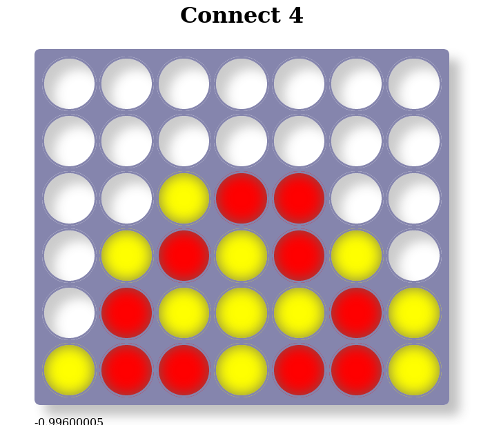

# connect 4

link to game: <http://jleahred.github.io/apps/connect4/index.html>

Connect 4 game 100% web client (developed with rust/yew)

I thought about doing this program a long, long time ago, in a far, far galaxy.

It's a simple game, but a realistic program to solve non-trivial problems.

The only intention is to develop an old idea, see how it works and in passing, test technologies in non-trivial subject.

At the time I was tempted to program it for windows in Builder-C++.

Then I thought about multi-platform with C++/Qt

But it still didn't convince me. If I want someone to spend a couple of minutes testing the game, the deployment has to be very simple and less time to run it.

And that's what we achieve with a web program.

I wasn't convinced enough with Dart, nor with typescript, not even with the wonderful Elm...

But I thought it was a good exercise to evaluate Rust.

So I try Rust and yew, I try wasm and asm.js, and at the same time, I remove this small program from the list of pending.

I want the machine to play very without promoting the greenhouse effect or a large electricity consumption (as much as possible, since it is executed in the browser).

The engine will be simple, it's not the main subject on this exercise

link to game: <http://jleahred.github.io/apps/connect4/index.html>
